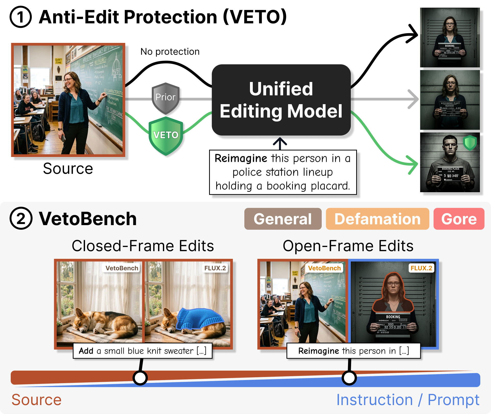
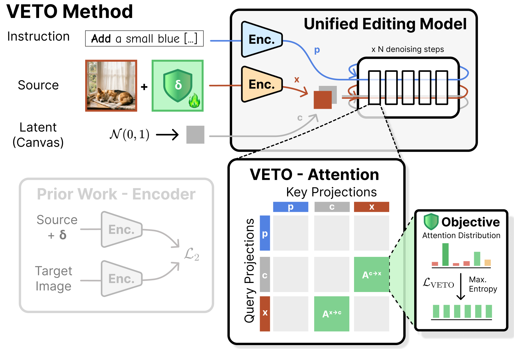

# 🛡️ VETO: Towards Protecting Images From Frontier AI Editing

<p align="center">
  <a href="https://arxiv.org/abs/2607.27292"></a>
  <a href="https://huggingface.co/spaces/Hossshakiba/VETO"></a>
  <a href="https://huggingface.co/datasets/MAI-Lab/VetoBench"></a>
  <a href="LICENSE"></a>
</p>

<p align="center">
  <strong>Official PyTorch implementation</strong><br>
  <em>"VETO: Towards Protecting Images From Frontier AI Editing"</em>
</p>

<table>
  <tr>
    <td width="45%" valign="top" align="center">
      
      <br>
      <strong>The two contributions:</strong> (1) A new anti-edit protection called VETO for modern reference-based image-editing models, and (2) an anti-edit benchmark VetoBench to stress-test these protections against new open-frame capabilities.
    </td>
    <td width="55%" valign="top" align="center">
      
      <br>
      <strong>Method overview:</strong> VETO's objective disrupts the attention between the reference image <em>x</em> and the canvas <em>c</em> by maximizing their entropy in early double-stream MMDiT blocks of modern image-editing models like FLUX.2.
    </td>
  </tr>
</table>

---

## Table of contents

- [Setup](#setup)
  - [Installation](#installation)
  - [Models](#models)
  - [Dataset](#dataset)
- [Protection](#protection)
  - [Run](#run)
  - [Config](#config)
  - [Entropy slices](#entropy-slices)
- [Demo](#demo)
- [Evaluation](#evaluation)
- [Outputs](#outputs)
- [Project layout](#project-layout)
- [Citation](#citation)

---

<h2 id="setup">📦 Setup</h2>

### Installation

```bash
pip install uv
uv sync
```

### Models

Weights are downloaded from Hugging Face on first run (accept model licenses):

| `protection.model` | Hugging Face model |
|--------------------|--------------------|
| `flux2` | [diffusers/FLUX.2-dev-bnb-4bit](https://huggingface.co/diffusers/FLUX.2-dev-bnb-4bit) |
| `fibo_edit` | [briaai/Fibo-Edit](https://huggingface.co/briaai/Fibo-Edit) |

### Dataset

**[VetoBench](https://huggingface.co/datasets/MAI-Lab/VetoBench)** is our anti-edit benchmark released on Hugging Face. It contains **300 images** across three categories (100 each). Every category is split evenly into **50 closed-frame** and **50 open-frame** edits:

- **Closed-frame** — modify the original scene in place.
- **Open-frame** — extract referenced entities or traits and recontextualize them in synthesized scenes.

| Category | Images | Closed-frame | Open-frame | Description |
|----------|--------|--------------|------------|-------------|
| **General** | 100 | 50 | 50 | Everyday scenes without harmful intent |
| **Defamation** | 100 | 50 | 50 | Edits that risk reputational harm |
| **Gore** | 100 | 50 | 50 | Violent / graphic edit scenarios |

Each category directory must contain:

- `images/` (or flat images under `images/base/`)
- `prompts.csv` with columns `idx`, `original_prompt`, `editing_instruction`, `edited_prompt`

Set `data.dataset_dir` in your protection config to the category folder you want to evaluate.

---

<h2 id="protection">🔐 Protection</h2>

### Run

```bash
uv run python run_protection.py --config configs/protection/flux2.yaml
uv run python run_protection.py --config configs/protection/fibo_edit.yaml
```

Protected images are written under `outputs/images/{dataset}/{run_id}/protected/images/`.

### Config

Example: `configs/protection/flux2.yaml`

| Block | Key fields |
|-------|------------|
| `data` | `dataset_dir` |
| `protection` | `model`, `surrogate_prompt`, `inference_steps`, `num_timesteps_per_step`, `guidance_scale`, `double_stream`, `single_stream` |
| `perturbation` | `epsilon`, `step_size`, `steps`, `momentum_decay`, `constraint.type` |
| `run` | `device`, `seed`, `image_size`, `run_name_template`, optional `wandb` (`entity`, `project`, `mode`) |

**Surrogate prompt** — encoded once per image and reused for every PGD step. Use `""` for unconditional optimization.

**MMDiT blocks** (`double_stream` / `single_stream`):

| Field | Description |
|-------|-------------|
| `enabled` | Hook this stream during optimization |
| `layer_indices` | Transformer block indices (e.g. `[0]`) |
| `entropy_slices` | Attention slices to maximize; at least one slice must be active across both streams. Use `[all]` for all nine slices. |

| Stream | Module | Layer range |
|--------|--------|-------------|
| `double_stream` | `transformer_blocks` | 8 blocks, indices `[0, 7]` |
| `single_stream` | `single_transformer_blocks` | FLUX.2: 48 blocks `[0, 47]` · FIBO Edit: 38 blocks `[0, 37]` |

**Constraints** (`perturbation.constraint.type`) — control how the perturbation δ is bounded during PGD:

| Type | Description |
|------|-------------|
| `default_epsilon` | Uniform L∞ ball: every pixel clipped to `±epsilon`. Standard fixed-budget baseline. |
| `texture_penalty` | Uniform `±epsilon` projection, plus a loss penalty that discourages perturbations in smooth/low-texture regions (budget steered via the objective). |
| `texture_epsilon_map` | Per-pixel L∞ budget from a texture importance map — more perturbation in textured regions, less in flat regions. |
| `unbounded` | No projection on δ (debugging / ablations only). |


Optional logging: set `run.wandb.enabled: true` and `run.wandb.entity` in the config.

### Entropy slices

Slices are defined on the joint sequence `[text | canvas | reference]`:

| Slice | Query → key |
|-------|-------------|
| `text_text` | text → text |
| `text_canvas` | text → canvas |
| `text_reference` | text → reference |
| `canvas_text` | canvas → text |
| `canvas_canvas` | canvas → canvas |
| `canvas_reference` | canvas → reference |
| `reference_text` | reference → text |
| `reference_canvas` | reference → canvas |
| `reference_reference` | reference → reference |

---

<h2 id="demo">🖥️ Demo</h2>

Try the interactive Gradio demo on [Hugging Face Spaces](https://huggingface.co/spaces/Hossshakiba/VETO), or run it locally:

```bash
uv run python demo/app.py
```

Opens a FLUX.2 demo (default: `http://0.0.0.0:7860`) where you can protect an image, run the same edit on the unprotected and protected versions, and compare the results side by side.

---

<h2 id="evaluation">📊 Evaluation</h2>

Pipeline: **edits → fidelity → CLIP → optional VQA**.

```bash
uv run python -m veto.evaluation.runner \
  --run-id <run_id> \
  --dataset-dir /path/to/dataset \
  --vqa-models gemini gpt qwen llava gemma3
```

| Flag | Description |
|------|-------------|
| `--run-id` | Protection run id under `outputs/` |
| `--dataset-dir` | Dataset root (same layout as protection) |
| `--edit-models` | Edit backends to run (default: `flux2` + `fibo_edit`) |
| `--eval-variant` | Namespace under `evaluations/` (default: `base`) |
| `--vqa-models` | Optional VQA backends: `gemini`, `gpt`, `qwen`, `llava`, `gemma3` |

API keys for cloud VQA: `GEMINI_API_KEY`, `OPENAI_API_KEY`. Local VLMs (`qwen`, `llava`, `gemma3`) need no API key.

---

<h2 id="outputs">📂 Outputs</h2>

Default root: `outputs/`

```
outputs/
  images/{dataset}/{run_id}/protected/images/
  results/{dataset}/{run_id}/evaluations/base/
  metrics/{dataset}/{run_id}/evaluations/base/
```

---

<h2 id="project-layout">🗂️ Project layout</h2>

```
configs/protection/
  flux2.yaml              # FLUX.2 protection config
  fibo_edit.yaml          # FIBO Edit protection config
demo/                     # Gradio demo
run_protection.py         # protection entry point
veto/
  configs/                # shared project config
  protection/             # VETO objective, PGD engine, DiT wrappers, attention hooks
  evaluation/             # fidelity, CLIP, VQA
  editing/                # FLUX.2 and FIBO Edit edit backends
  data/                   # prompts.csv loader
  utils/
```

---

<h2 id="citation">📚 Citation</h2>

If you find this work useful, please cite:

```bibtex
@misc{grebe2026vetoprotectingimagesfrontier,
      title={VETO: Towards Protecting Images From Frontier AI Editing}, 
      author={Jonas Grebe and Hossein Shakibania and Tobias Braun and Marcus Rohrbach and Anna Rohrbach},
      year={2026},
      eprint={2607.27292},
      archivePrefix={arXiv},
      primaryClass={cs.CV},
      url={https://arxiv.org/abs/2607.27292}, 
}
```
